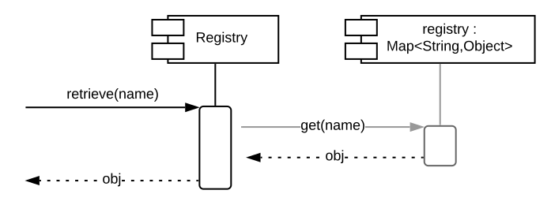

# K2 Registry Design

The K2 Registry is a python module.  The diagram bwlow shows an overview of the module.

## Global Registry

The module includes a global registry available at `k2.registry.registry`.
The `@register` decorator and `retrieve` methods of the module register and retrieve items in the global registry.

## Global Registrations

The module provides an `@registration` decorator method to identify registrations functions.
Registration functions are called for each item registered with the registry during registration.

The diagram below shows the structure of the `@registration` decorator of the module.

Registration functions registered with `k2.registry.registration` decorator are global registrations and are applied by all Registry instances

## Module Import Sequence

The diagram below shows the sequence logic of the module import.

## Registry Class

The K2 Registry defines a `Registry` class.  All instances K2 Registries are instances of the `Registry` class.

The diagram below shows the structure of the `Registry` class

### Registry Registrations

The global `@registration` decorator defines global registration functions.  The `Registry` class defines a local `@registration` decorator method.
Decorating a function with the `@registration` decorator of a Registry instance adds the decorated function as a registration function to the Registry instance.

The diagram below shows the structure of the `Registry.registration` decorator function.

### Registry Register

The Registry class defines a `@register` decorator.  Items decorated with the `@register` decorator of the `Registry` class are registered with the Registry instance.

The diagram below shows the sequence of the `Registry.register` decorator function.

The register decorator may be called with a name for the registered item.  If the name is omitted then the `__name__` of the registered item is used.

### Registry Apply Registrations

When an item is registered with a Registry the global registrations are applied to the registered item and then the registrations of the Registry are applied.

The diagram below shows the structure of the `Registry.applyRegistrations` method.

### Registry Retrieve

The Registry class defines a `retrieve` method to retrieve registered items from the registry.
Items are retrieved from the Registry by the name with which they were registered.

The diagram below shows the sequence of the `Registry.retrieve` method.

 

